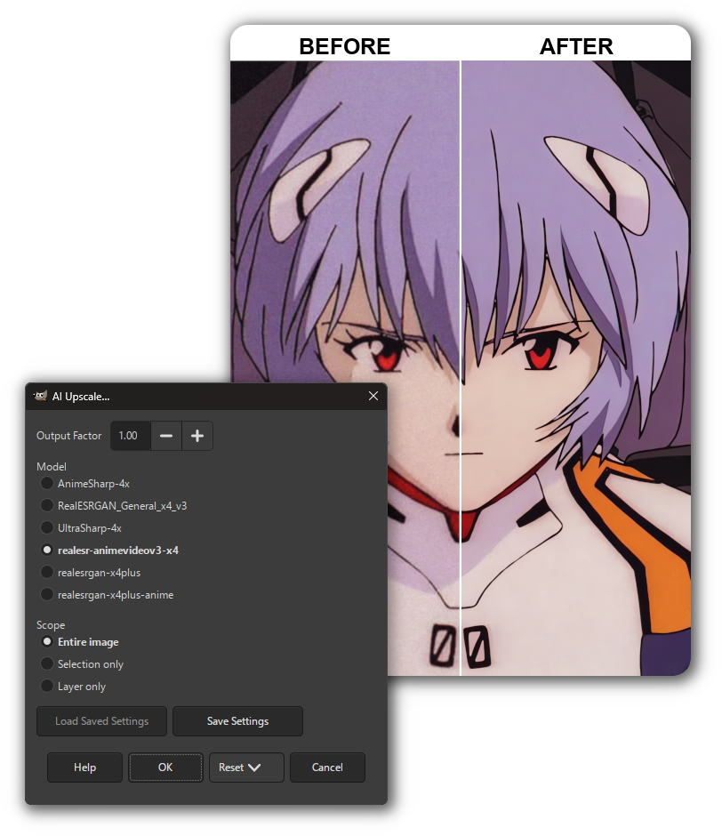
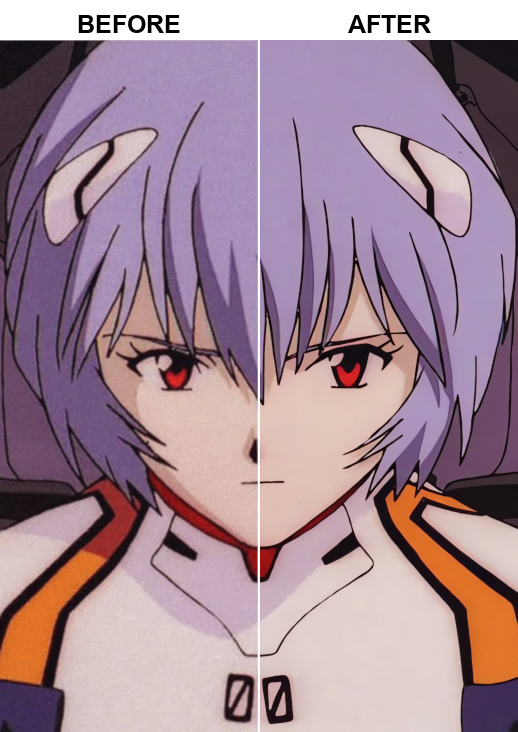
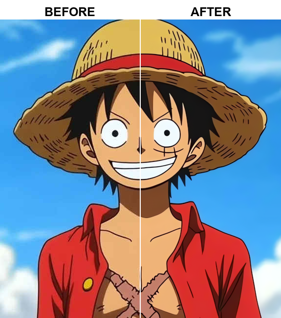
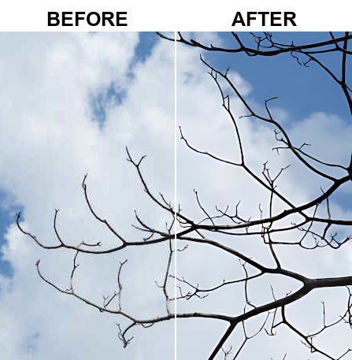

<h1 align="center">
  
  gimp_upscale
</h1>

<p align="center">
  Upscale directly within GIMP (2.10 and 3.0) using realesrgan-ncnn-vulkan
</p>



  


# Features

- Works with GIMP 2.10 and GIMP 3.0
- Choose between 6 built-in models:
  - `realesr-animevideov3-x4`, `RealESRGAN_General_x4_v3`,
  - `realesrgan-x4plus`, `realesrgan-x4plus-anime`,
  - `UltraSharp-4x`, `AnimeSharp-4x`
- Upscale the entire image/layer, or only the selection.
- Scale the output to any factor from 0.1x to 8x.
- Cleanly upscale transparent alpha channels.
- Use any other custom 4x ESRGAN model (.bin/.param NCNN).

<details>
<summary>Adding your own custom ESRGAN models to the plug-in...</summary>

- Add your own models (NCNN) to the `resrgan/models` folder inside the plug-in you installed:
  - For GIMP 2.10: `.../plug-ins/gimp2_upscale/resrgan/models`
  - For GIMP 3.0: `.../plug-ins/gimp3_upscale/resrgan/models`
- Additional models can be found at https://openmodeldb.info/
- At this time, only `4x`/`x4` models are supported.
- Each model must include a matching pair: `model.param` and `model.bin` (same filename stem).
  - `.pth` model format is not supported.
- Models can be converted to NCNN format with tools like:
  - [Chainner](https://github.com/chaiNNer-org/chaiNNer) or [custom scripts](https://github.com/xinntao/Real-ESRGAN-ncnn-vulkan/issues/59#issuecomment-2078688728)
</details>

<br>

# Upscale Examples

<details>
<summary>Expand the section below to see example images...</summary>








</details>

<br>

# 💾 Install
> [!WARNING]
> - Vulkan-compatible GPU required.

 

  

---

1) Download the [latest release](https://github.com/Nenotriple/gimp_upscale/releases)
   - `gimp2_upscale.zip` for GIMP 2.10
   - `gimp3_upscale.zip` for GIMP 3.0
2) Extract the plug-in folder into your GIMP plug-ins directory
3) Restart GIMP

### Extra info
<details>
<summary>Find your GIMP plug-in directory...</summary>

- You can always **find your plug-in folder** from:
  - `GIMP > Edit > Preferences > Folders > Plug-ins`
- Default directory for Windows:
  - `C:\Users\%USERNAME%\AppData\Roaming\GIMP\3.0\plug-ins`
  - `C:\Program Files\GIMP 2\lib\gimp\3.0\plug-ins`
  - `C:\Users\%USERNAME%\AppData\Roaming\GIMP\2.10\plug-ins`
  - `C:\Program Files\GIMP 2\lib\gimp\2.0\plug-ins`
- Default directory for Linux:
  - `~/.config/GIMP/2.10/plug-ins`
  - `~/.config/GIMP/3.0/plug-ins`
</details>

<details>
<summary>Example directory structure...</summary>

GIMP plug-ins must be in a folder structure where the script filename matches the parent folder:

```plaintext
plug-ins
|
├── gimp2_upscale
│   ├── gimp2_upscale.py
│   └── resrgan
│       ├── realesrgan-ncnn-vulkan(.exe)
│       └── models
│           ├── model.param
│           └── model.bin
|
└── gimp3_upscale
    ├── gimp3_upscale.py
    └── resrgan
        ├── realesrgan-ncnn-vulkan(.exe)
        └── models
            ├── model.param
            └── model.bin
```
</details>

<details>
<summary>Additional information for Linux...</summary>

- The flatpak version of GIMP usually includes Python support.
- For GIMP 2.10, some distros require installing `gimp-python`.
</details>

<br>

# 📝 Usage

1) Open an image in GIMP
2) Go to `Filters > Enhance > AI Upscale…`
3) Adjust options as needed
4) Click Run/OK and wait for processing

<br>

# 🌟 Projects Using `gimp_upscale`

Here are some awesome projects that have used `gimp_upscale`:

| Creator | Description | Project Link |
| - | - | - |
| [@typokiow](https://next.nexusmods.com/profile/typokiow?gameId=7587) | **HQ Oblivion in-game map** — Replace the world map making it sharper and more legible without altering the original aesthetic.  | https://www.nexusmods.com/oblivionremastered/mods/1598?tab=description |

> 🎨 Have you used `gimp_upscale` in a project?
> [Open an issue](https://github.com/Nenotriple/gimp_upscale/issues) to be featured here!

<br>

# 👥 Thanks!

- [GIMP](https://www.gimp.org/) - GPL-3.0
- [xinntao - Real-ESRGAN_portable](https://github.com/xinntao/Real-ESRGAN#portable-executable-files-ncnn) - BSD-3-Clause license
