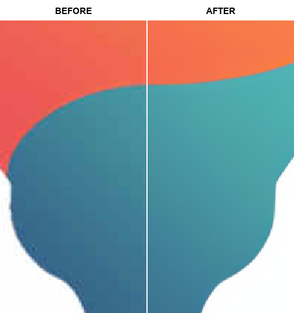
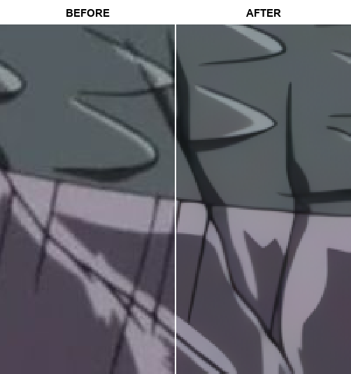
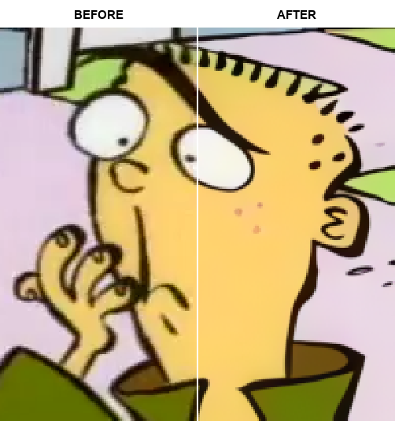

# GIMP Upscale Plugin – AI Image Upscaler (RealESRGAN) for GIMP 2.10 & 3.0

**GIMP Upscale** is an open-source plugin that brings advanced AI-powered image upscaling to GIMP. Using RealESRGAN technology, this plugin lets you enhance image resolution, improve photo quality, and upscale anime artwork with ease, supporting custom ESRGAN models and both Windows and Linux platforms.


  

  

## Features

- Works with GIMP 2.10 and GIMP 3.0
- Choose between 6 built-in models:
  - `realesr-animevideov3-x4`
  - `RealESRGAN_General_x4_v3`
  - `realesrgan-x4plus`
  - `realesrgan-x4plus-anime`
  - `UltraSharp-4x`
  - `AnimeSharp-4x`
- Upscale the entire image/layer, or only the selection.
- Scale the output to any factor from 0.1x to 8x.
- Cleanly upscale transparent alpha channels.
- Use custom 4x ESRGAN models (NCNN: `.param` + `.bin`).

<details>
<summary>Add custom ESRGAN models to the plug-in...</summary>

- Get models:
  - Browse ESRGAN NCNN x4 models on [OpenModelDB](https://openmodeldb.info/).
  - You can also find models on GitHub, Hugging Face, and other repositories.

- Where to put models:
  - Place both files side by side in the plug-in `models` folder.
  - GIMP 2.10: `.../plug-ins/gimp2_upscale/resrgan/models`
  - GIMP 3.0: `.../plug-ins/gimp3_upscale/resrgan/models`
    - Example:

      ```plaintext
      resrgan/
      └── models/
          ├── UltraSharp-4x.param
          └── UltraSharp-4x.bin
      ```

- Supported formats:
  - ESRGAN-NCNN format only: `.param` and `.bin` files.
  - Only native 4x (x4) models are supported.
  - Filename stems must match (e.g., `model.param` + `model.bin`).
  - `.pth` is not supported.

- Convert to NCNN (if needed):
  - Use [ChaiNNer](https://github.com/chaiNNer-org/chaiNNer).
  - Or follow this [community guide](https://github.com/xinntao/Real-ESRGAN-ncnn-vulkan/issues/59#issuecomment-2078688728).
  - Output must be a matching `.param` + `.bin` pair.

- Verify in GIMP:
  - Open `Filters > Enhance > AI Upscale...`.
  - Check the Model list for your model name (derived from the filename stem).
  - If it doesn’t appear: confirm the folder path, format support, and matching filenames, then restart GIMP.

</details>

## Upscale Examples

<details>
<summary>Expand to see example images...</summary>


</details>

## 💾 Install

> [!WARNING]
> Vulkan-compatible GPU required.

 

  

1. Download the [latest release](https://github.com/Nenotriple/gimp_upscale/releases):
   - `gimp2_upscale.zip` for GIMP 2.10
   - `gimp3_upscale.zip` for GIMP 3.0
2. Extract the plug-in folder into your GIMP plug-ins directory.
3. Restart GIMP.

> [!NOTE]
> **Linux note:** After extracting to your GIMP plug-ins folder, you must mark the script as executable so GIMP can detect it:
>
> ```bash
> chmod +x gimp2_upscale.py
> chmod +x gimp3_upscale.py
> ```

## 📝 Usage

1. Open an image in GIMP.
2. Go to `Filters > Enhance > AI Upscale...`.
3. Adjust options as needed.
4. Click Run/OK and wait for processing.

### Extra Info

<details>
<summary>Find your GIMP plug-in directory...</summary>

- Find your plug-in folder via:
  - `GIMP > Edit > Preferences > Folders > Plug-ins`
- Default Windows directories:
  - `C:\Users\%USERNAME%\AppData\Roaming\GIMP\3.0\plug-ins`
  - `C:\Program Files\GIMP 2\lib\gimp\3.0\plug-ins`
  - `C:\Users\%USERNAME%\AppData\Roaming\GIMP\2.10\plug-ins`
  - `C:\Program Files\GIMP 2\lib\gimp\2.0\plug-ins`
- Default Linux directories:
  - `~/.config/GIMP/2.10/plug-ins`
  - `~/.config/GIMP/3.0/plug-ins`

</details>

<details>
<summary>Example directory structure...</summary>

```plaintext
plug-ins/
|
├── gimp2_upscale/
│   ├── gimp2_upscale.py
│   └── resrgan/
│       ├── realesrgan-ncnn-vulkan(.exe)
│       └── models/
│           ├── model.param
│           └── model.bin
|
└── gimp3_upscale/
    ├── gimp3_upscale.py
    └── resrgan/
        ├── realesrgan-ncnn-vulkan(.exe)
        └── models/
            ├── model.param
            └── model.bin
```

---

## 🌟 Projects Using gimp_upscale

Here are some projects that use gimp_upscale:

| Creator | Description | Project Link |
| --- | --- | --- |
| [@typokiow](https://next.nexusmods.com/profile/typokiow?gameId=7587) | **HQ Oblivion in-game map** — Replace the world map making it sharper and more legible without altering the original aesthetic. | [Nexus Mods page](https://www.nexusmods.com/oblivionremastered/mods/1598?tab=description) |

> 🎨 Have you used `gimp_upscale` in a project?
> [Open an issue](https://github.com/Nenotriple/gimp_upscale/issues) to be featured here!

## 👥 Thanks!

- [GIMP](https://www.gimp.org/) - GPL-3.0
- [xinntao - Real-ESRGAN_portable](https://github.com/xinntao/Real-ESRGAN#portable-executable-files-ncnn) - BSD-3-Clause license
